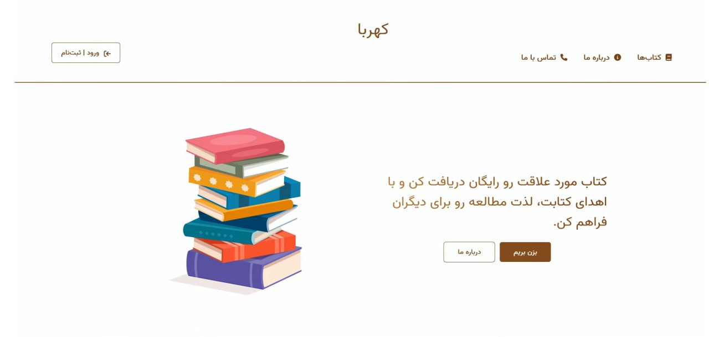

# Book Recommendation System for Book Donation Website

## Overview

This repository contains the implementation of a Book Recommendation System for a book donation website. The system suggests the most relevant books to users based on the abstracts of the books. It utilizes embeddings, cosine similarity, and PCA (Principal Component Analysis) for recommendation.

## Features

- **Embedding Extraction:** The system extracts embeddings from the book abstracts to represent the semantic features of each book.

- **Cosine Similarity:** The recommendation algorithm calculates the cosine similarity between book embeddings to find the most similar books.

- **PCA Dimensionality Reduction:** PCA is employed to reduce the dimensionality of the embedding output, optimizing resource usage for a higher number of concurrent users with lower computational load.

## Implementation Details

- **Backend:** The backend is developed using Django, providing a robust and scalable server-side architecture.

- **Frontend:** The frontend is built using React, offering a responsive and user-friendly interface.

## Implementation Details

- **Backend:** The backend is developed using Django, providing a robust and scalable server-side architecture.

- **Frontend:** The frontend is built using React, offering a responsive and user-friendly interface.

- **Recommendation System Libraries:**
  - Gensim: Used for embedding that is trained by Gensim library.
  - Scikit-learn (Sklearn): Utilized for cosine similarity calculation and PCA.
  - NumPy: Employed for numerical operations.
  - Pandas: Used for data manipulation.
  - Hazm: Integrated for persian natural language processing tasks, such as stemming and tokenization in the Persian language.
